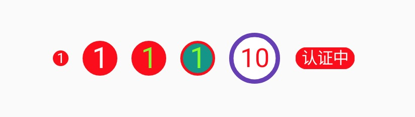

# YBubbleView 

角标气泡

| 属性 | 描述 |
|---|---|
| bubble_bgColor | 背景色 |
| bubble_borderColor | 边框色 |
| bubble_borderSize | 边框尺寸 |
| bubble_count | 数值文本，为 0 隐藏 |
| bubble_text | 任意文本 |
| bubble_textSize | 文本尺寸 |
| bubble_textColor | 文本色 |
| bubble_radius | 圆角尺寸 |
| bubble_circle | 是否圆角 |
| bubble_round | 是否圆形 |
